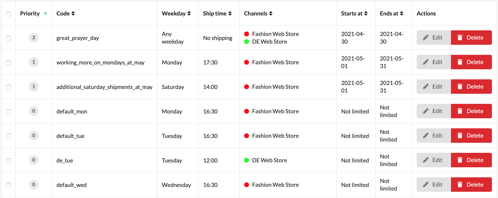
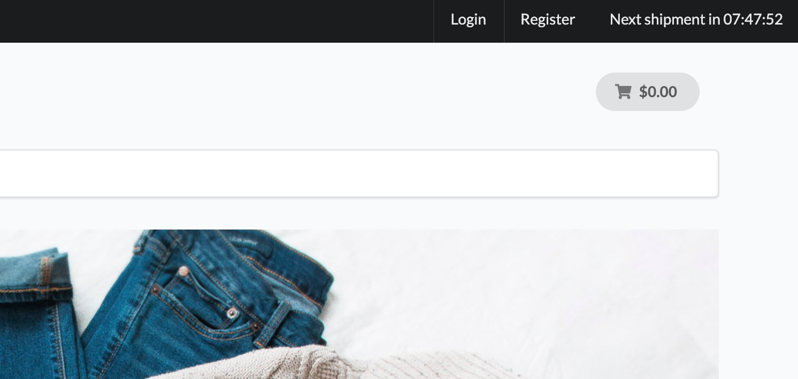

# SyliusShippingCountdownPlugin

[![Latest Version][ico-version]][link-packagist]
[![Latest Unstable Version][ico-unstable-version]][link-packagist]
[![Software License][ico-license]](LICENSE)
[![Build Status][ico-github-actions]][link-github-actions]
[![Code Coverage][ico-code-coverage]][link-code-coverage]

## Screenshots





## Installation

### Require plugin with composer:

```bash
$ composer require setono/sylius-shipping-countdown-plugin
```

### Import configuration:

```yaml
# config/packages/setono_sylius_shipping_countdown.yaml
imports:
    - { resource: "@SetonoSyliusShippingCountdownPlugin/Resources/config/app/config.yaml" }

    # Uncomment next line if you're using Webpack Encore
    # - { resource: "@SetonoSyliusShippingCountdownPlugin/Resources/config/app/config_webpack.yaml" }
    
    # You can also import example fixtures to play
    # - { resource: "@SetonoSyliusShippingCountdownPlugin/Resources/config/app/fixtures.yaml" }
```

### Import routing:

```yaml
# config/routes/setono_sylius_shipping_countdown.yaml
setono_sylius_shipping_countdown:
    resource: "@SetonoSyliusShippingCountdownPlugin/Resources/config/routes.yaml"
```

or if your app doesn't use locales:

```yaml
# config/routes.yaml
setono_sylius_shipping_countdown:
    resource: "@SetonoSyliusShippingCountdownPlugin/Resources/config/routes_no_locale.yaml"
```

### Add plugin class to your `bundles.php`:

Make sure you add it before `SyliusGridBundle`, otherwise you'll get
`You have requested a non-existent parameter "setono_sylius_shipping_countdown.model.shipping_schedule.class".` exception.

```php
<?php
$bundles = [
    // ...
    Setono\SyliusShippingCountdownPlugin\SetonoSyliusShippingCountdownPlugin::class => ['all' => true],
    Sylius\Bundle\GridBundle\SyliusGridBundle::class => ['all' => true],
    // ...
];
```

### Update your database:

```bash
bin/console doctrine:migrations:diff
bin/console doctrine:migrations:migrate
```

### Install assets:

```bash
php bin/console assets:install
```

### Clear cache:

```bash
php bin/console cache:clear
```

## Debug schedule

You can use `setono:shipping-countdown:debug` command to debug schedule.

Examples:

```
bin/console setono:shipping-countdown:debug
bin/console setono:shipping-countdown:debug '+1 day'
bin/console setono:shipping-countdown:debug '2021-04-29 16:29'
bin/console setono:shipping-countdown:debug '2021-04-29 16:31'
```

[ico-version]: https://poser.pugx.org/setono/sylius-shipping-countdown-plugin/v/stable
[ico-unstable-version]: https://poser.pugx.org/setono/sylius-shipping-countdown-plugin/v/unstable
[ico-license]: https://poser.pugx.org/setono/sylius-shipping-countdown-plugin/license
[ico-github-actions]: https://github.com/Setono/SyliusShippingCountdownPlugin/workflows/build/badge.svg
[ico-code-coverage]: https://codecov.io/gh/Setono/SyliusShippingCountdownPlugin/branch/master/graph/badge.svg

[link-packagist]: https://packagist.org/packages/setono/sylius-shipping-countdown-plugin
[link-github-actions]: https://github.com/Setono/SyliusShippingCountdownPlugin/actions
[link-code-coverage]: https://codecov.io/gh/Setono/SyliusShippingCountdownPlugin
